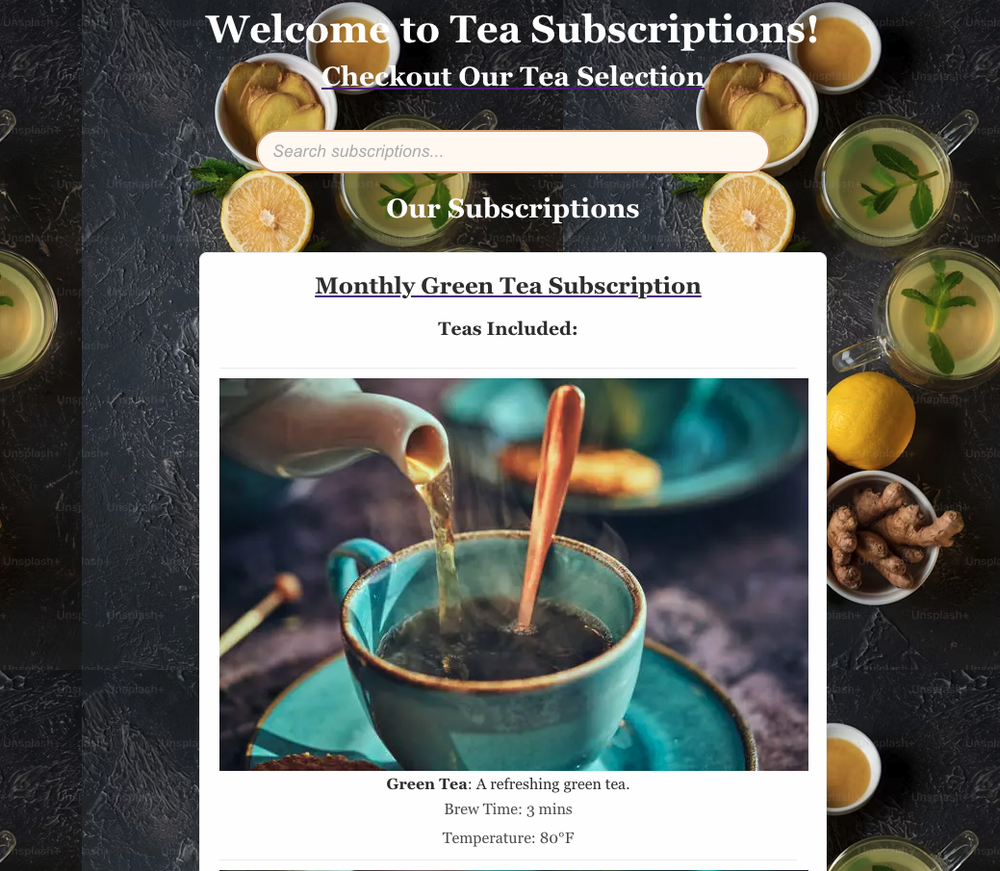

Tea Subscriptions App 🍵

## Table of Contents
1. [Overview](#overview)
2. [Features](#features)
3. [Installation](#installation)
4. [Usage](#usage)
5. [Technologies Used](#technologies-used)
6. [Contributing](#contributing)

---

### Overview

**Tea Subscription App** is a React-based application where users can explore different tea subscriptions, learn about tea details, and search for specific teas. This project allows users to view subscription options, browse teas, and explore various features like a search bar to filter subscriptions.

---

### Features

- **Browse Tea Subscriptions**: View different subscription options with details.
- **Search Functionality**: Search for teas based on keywords.
- **Responsive Design**: Optimized for different screen sizes.
- **Subscription Details**: Learn about each subscription and its contents.
- **Image Gallery**: Each subscription includes icons of the teas.

---

### Installation

To run this app locally, follow these steps:

1. Clone the repository:
   git clone https://github.com:MDelarosa1993/Tea_Subscriptions.git

2. Navigate to the project directory:
   cd react-take-home x2

3. Install dependencies:
   npm install

4. Start the development server:
   npm start
   

Your app will be running at `http://localhost:3001`.
There is a backend for this: https://github.com/MDelarosa1993/Tea_Subscriptions_Api
---

### Usage

Once the app is running, you can:

- Navigate through the main page to see available tea subscriptions.
- Use the search bar to filter teas and subscriptions.
- View tea details by clicking on a subscription.
- Explore different tea descriptions, brew time, and temperatures.
- You can cancel and activate your subscription just by a click of a button

---

### Technologies Used

- **React**: The core framework used for building the user interface.
- **React Router**: For managing page navigation.
- **CSS**: For styling the app.
- **Npm**: For running the app and managing dependencies.
- **RubyOnRails**: For the Api
- **Cypress** - For end-to-end testing

---

### Contributing

1. Fork the repository.
2. Create a new branch (`git checkout -b feature-branch`).
3. Make your changes and commit them (`git commit -am 'Add new feature'`).
4. Push to the branch (`git push origin feature-branch`).
5. Create a pull request.

---

